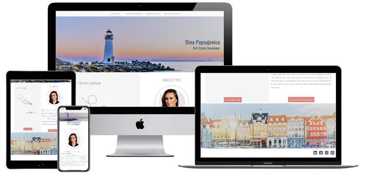
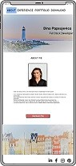
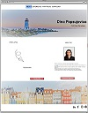
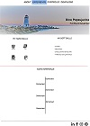
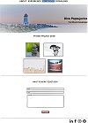

# Dina Papsujevica Portfolio

Milestone Project 1 - User-Centric Front-end

The website is created with the purpose to present potential employers and recruiters with myself, my skills and work experience as well as previous projects I have worked on.

## UX

### Mockup

The website has been made very simple and easily understandable for the user. It is easy to navigate through sections and to find a way to contact me.
My goal in the design was to tell the user a story about a girl with big dreams, who has grown up in the small city by the beach.
Until one day, life takes her to the big city - Copenhagen.

As an employer I want to see previous projects Dina was working on, her skills and abilities. 

Website consists of 4 sections:

    * About
    * Experience
    * Portfolio
    * Download

Wireframes available here:

* 
* 
* 
* 

## Features

### Existing Features

All sections are easy to navigate from navbar on top. In screen size extra small and small navbar reduces into 3 sections.
As the Download button is placed right after the About me text in the landing page, I chose to remove Download from navbar
for all sizes except large and extra large.

Top image and social media links in the footer follows through all sections.
Social media links open in a new tab and take the user directly to my profiles.

#### About

This section gives to the user two experiences. 

As a user you are able to read a short description about me and my strengths.
At the bottom of the page (above the bottom image) there are two call to action buttons: Contact Me and Download Resume.

If the website is viewed on a desktop, **About** section transforms into two columns, as a user you can read a "story" which was created behind this website.
In smaller screen sizes this part is hidden, leaving the space for About me info.

Pressing the Download Resume button the user is able to open my resume in the new tab and download it. 
The button Contact Me will link the user to the contact form in the **Portfolio** section.

#### Experience

As a user you can see a list of my Soft and Hard skills.
In this section, the user can read about my Work experience, which is placed in the bottom part of the page.

#### Portfolio

As a user you are able to see images of my previously done projects. 
In the bottom part of the page as a user you are able to send me Work together request. 
Filling out the form user contacts me. 
After pressing the button - Send Request, user can read Thank You message from me, which informs that i will contact back within 1-2 business days.
For the user it gives a feeling of my presence.

#### Download

As a user you are able to open my resume in the new tab and download it.

### Features Left to Implement

* In the **Portfolio** section I would like to add real projects, to give them animation, like a Image Hover Overlay with the project name, description and link to it.
* Paper plane which is right now as a PNG file, I would like to make it animated.
* I would like to make Work together form to be required to fill completely to be able submit request.
  The 'required' attribute is added to the name, email, and message fields, so if those fields are not filled in, the form will not submit.

## Technologies Used

* HTML
* CSS
* Bootstrap 4.5.2 (https://getbootstrap.com/)
    * Bootstrap was used as it was a convenient solution for several objects in my website.

## References

* Code institute video projects
    * I used some snippets from course tutorials as I saw them useful for my own project. 
* W3scools.com (https://www.w3schools.com/)
    * was used for Responsive Image Grid in my **Portfolio** section, hero image 
* [CSS tricks] (https://css-tricks.com/snippets/css/a-guide-to-flexbox/)

## Testing

For testing code validity i used:

* [W3C Markup Validation](https://validator.w3.org/)
* [W3C CSS Validation](https://jigsaw.w3.org/css-validator/)

During the tests the user story was achieved, providing the user with information of myself and my work. 

1. About:
    * Go to website https://dinapapsujevica.github.io/MP1-Portfolio/
    * Try to navigate through navbar on top. All sections opens smoothly, emphasizing the active section with underline.
    Navbar reduces into 3 sections in screen sizes extra small and small.
    * Try to press Contact Me button. It takes to **Portfolio** section where is Contact form to contact me. 
    * Try to press Download Resume button. 
    For the desktop user, resume opens in a new tab and gives opportunity to download it.
    For mobile phones - it will download to your default folder for downloads.

2. Experience:
    * Try to press **Experience** on navbar to open smoothly section with skills and previous work experience. 
    This section works responsive on different browsers and screen sizes.

3. Portfolio:
    * Try to press **Portfolio** on navbar to open smoothly section with conatct form and portfolio.
    * Try to press Send Request bellow the Contact form. Modal will pops up, giving nice feedback to the user that the message was received. 
    * Try to press Close to close modal.

4. Download:
    * Try to press **Download** on navbar to open resume in new tab and download it.
    On screen sizes extra small and small, option to Download Resume is available bellow About Me text on landing page.

5. Social media links:
    * Try to press Social media icons in the footer of each section through the whole website.
    Links will open in a new tab using target="_blank". All links have been manually tested to ensure that they are linked to the right destination.

### Fixed bugs

* responsivness of navbar in smaller sizes
* Contact Me and Download Resume button align in About section
* image path for Portfolio section

## Credits

### Content

All the content on this website was written by me.  

### Media

Header, Footer and paper plane images were taken from [Google.com](www.google.com), they were edited by me. 
My profile picture was taken from my personal folder.
Images for the **Portfolio** section were taken from [Pexels](www.pexels.com).

### Acknowledgements

* I received inspiration for this project from Code Institute projects like Love Running, Rosie and Whiskey Drop.
* Code Institute student support
* Slack community
* I received a help in the middle of project from Anna Porofijeva
* For testing user experience I received help from Ieva Malta

Website is created for educational use!

 

