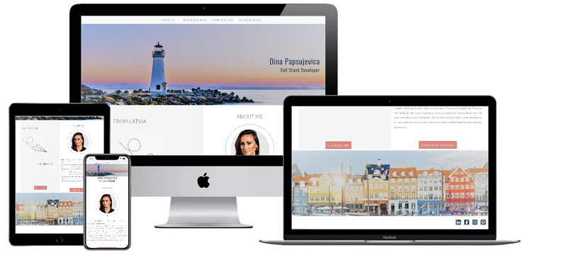
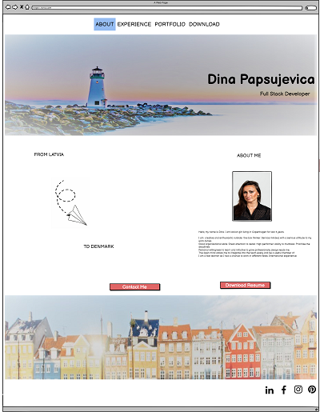
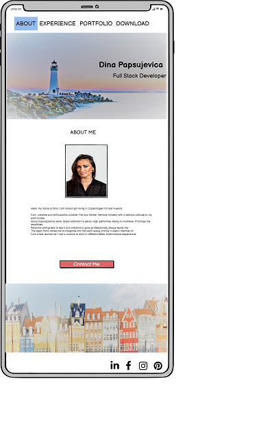
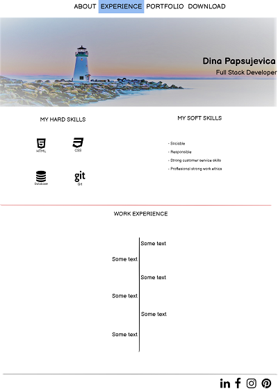

# Dina Papsujevica Portfolio

Milestone Project 1 - User-Centric Front-end

The website is created with the purpose to present potential employers and recruiters with myself, my skills and work experience as well as previous projects I have worked on.

## UX

### Mockup

The website has been made very simple and easy understandable for the user. It is easy to navigate through sections and 
easy to find a way to contact me.
My goal in the design was to tell the user a story about a girl with big dreams, who has grown up in the small city by the beach.
Until one day, life takes her to the big city - Copenhagen.

As an employer I want to see previous projects Dina was working on, her skills and abilities. 

Website consists of 4 sections:

    * About
    * Experience
    * Portfolio
    * Download

Wireframes for this website available here:

## Features

### Existing Features

All sections are easy to navigate from Navbar on top. In mobile, small and medium size Navbar reduces into 3 sections.
As the Download button is placed right after the About me text in the landing page, I chose to remove it from Navbar for all sizes except large and extra large.

Top image and social media links in the footer follows through all sections.
Social media links open in a new tab and take the user directly to my profiles.

#### About

This section gives to the user two experiences. 
For sizes below large, the user is able to see my profile picture, read a short description about me and my strengths.
At the bottom of the page (above the bottom image) are two call to action buttons: Contact Me and Download Resume.

For large and extra large size, About section transforms into two columns, where adds the "story" about my life with a paper plane image in it.

Pressing the Download Resume button the user is able to open my Resume in the new tab and download it. 
The button Contact Me will link the user to the contact form in the Portfolio section.

#### Experience

As a user you can see a list of my Soft and Hard skills.
In this section, the user can read about my Work experience, which is placed in the bottom part of the page.

#### Portfolio

As a user you are able to see images of my previously done projects. 
In the bottom part of the page the user can find a welcoming message to Work together. 
Filling out the form user contacts me. It is required to fill all fields to Submit the form.
After pressing the button - Send Request user can read Thank You message from me, which informs that i will contact back within 1-2 business days.

#### Download

As a user you are able to open my Resume in the new tab and download it.

### Features Left to Implement

* In the Portfolio section I would like to add real projects, maybe to give it some animation, like a slideshow with description and links to them.
* Paper plane which is right now as a PNG file, I would like to make it animated.

## Technologies Used

* HTML
* CSS
* Bootstrap 4.5.2 (https://getbootstrap.com/)
    * Bootstrap was used as it was a convenient solution for several objects in my website.
* Code institute video projects
    * I used some snippets from course tutorials as I saw them useful for my own project. 
* W3scools.com (https://www.w3schools.com/)
    * was used for Responsive Image Grid in my Portfolio section

## Testing

For testing code validity i used:

* [W3C Markup Validation](https://validator.w3.org/)
* [W3C CSS Validation](https://jigsaw.w3.org/css-validator/)

During the tests the user story was achieved, providing the user with information of myself and my work. 

Navbar links take the user through all sections, emphasizing the active section with underline.

In the about me section, users can read about my background and my strengths. 
If the website is viewed on a desktop, the user can read a "story" which was created behind this website.
In smaller sizes this part is hidden, leaving the space for About me info.

Call to action button - Contact Me takes user to contact form in Portfolio section. Contact form must be filled completely to be submitted.
The 'required' attribute is added to the name, email, and message fields, so if those fields are not filled in, the form will not submit. 
If all fields are valid, the user can read a message about being contacted in the next few days. That gives the user a feeling about my presence.

For the desktop user, Resume opens in a new tab and gives opportunity to download it.
For mobile phones - it will download to your default folder for downloads.

Social media links will open in a new tab using target="_blank". All links have been manually tested to ensure that they are linked to the right destination.

### Fixed bugs

* responsivness of Navbar in smaller sizes
* Contact Me and Download Resume button align in About section
* image path for Portfolio section

### Bugs to Fix

* 

## Credits

### Content

All the content on this website was written by me.  

### Media

Header, Footer and paper plane images were taken from [Google.com](www.google.com), they were edited by me. 
My profile picture was taken from my personal folder.
Images for the Portfolio section were taken from [Pexels](www.pexels.com), and from my friend's, with her permission, Sanita Masule [Artberry](www.artberry.lv) portfolio page.

### Acknowledgements

* I received inspiration for this project from CI tutorials like Love Running, Rosie and Whiskey Drop.
* Code Institute student support
* Slack community
* I received a help in the middle of project from Anna Porofijeva
* For testing user experience I received help from Ieva Malta

Website is created for educational use!

 

